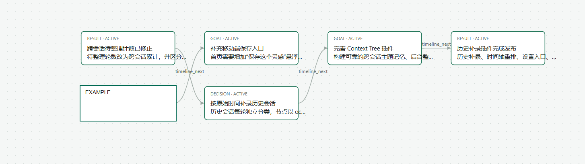
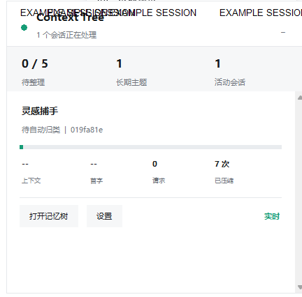
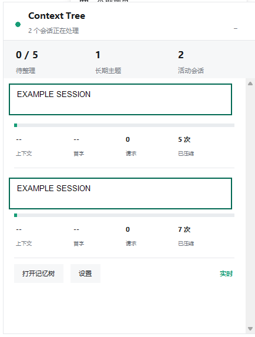
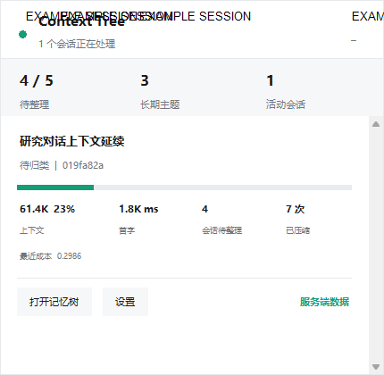
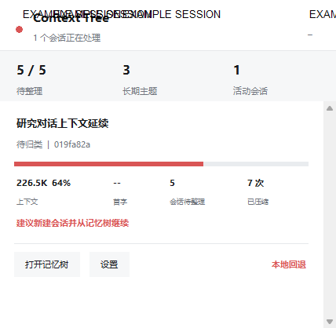
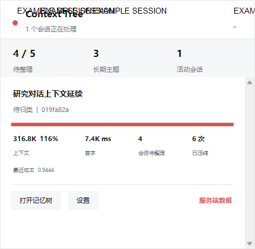
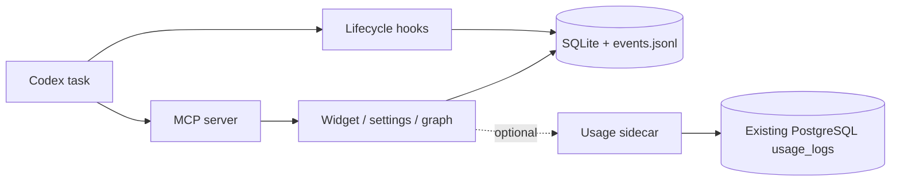
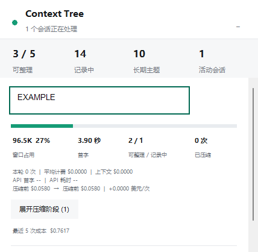

# Context Tree

一个面向 Codex 的 **local-first** 上下文记忆插件，以及一个可选的服务端用量适配层。插件负责把跨任务的目标、决定、结果和待办事项整理成可查询的记忆树；sidecar 只在需要真实费用、首字延迟和请求历史时连接已有 PostgreSQL 数据库。



## 能做什么

- 用 SQLite 保存本地主题、分支、节点和交接快照；JSONL 作为轻量恢复日志。
- 通过 `SessionStart`、`UserPromptSubmit`、`Stop` hooks 自动记录任务；后台整理只处理有界的待办摘要。
- 在支持 MCP Apps 的界面显示紧凑面板；不支持时仍可使用本地 CLI、设置页和桌面悬浮窗。
- 按真实模型窗口显示上下文占用，并把压缩阶段、缓存命中率和任务生命周期分开呈现。
- sidecar 可选：有服务端数据时显示真实成本；服务不可用时自动回退到本地估算。
- 历史会话可按原始时间导入、重排并继续生成交接。

### 界面示例

<p>
  
  
</p>

服务端真实用量和本地回退使用同一套界面：

<p>
  
  
</p>

高压状态仍显示同一组指标，并额外提示上下文占用：



## 架构



sidecar 是可选增强，不负责建表或迁移。如果你的 Sub2API 部署已经原生提供同样的 usage 路由，可以直接使用原生路由而不运行本目录的 sidecar。

## 目录结构

```text
.
├── .agents/plugins/marketplace.json       # 本地/GitHub Marketplace 清单
├── plugins/context-tree/                  # Codex 插件本体
│   ├── .codex-plugin/plugin.json
│   ├── assets/                            # MCP Apps 页面
│   ├── scripts/                           # SQLite、hooks、MCP、悬浮窗
│   ├── skills/manage-context-tree/
│   └── tests/
├── sidecar/                               # 可选真实用量 HTTP 适配层
├── docs/images/                           # 从说明文稿提取的示例截图
├── open-context-tree-settings.cmd
├── start-context-tree-float.cmd
├── refresh-context-tree.cmd
└── README.md
```

## 从 GitHub 安装

需要 Python 3.10+ 和可用的 Codex CLI：

```powershell
codex plugin marketplace add 15236702150master/context-tree-stack
codex plugin add context-tree@context-tree-local
```

安装或更新后，完全退出 Codex（包括托盘进程）并新建任务，然后让 Codex 显示 Context Tree。也可以直接从本地 checkout 添加：

```powershell
codex plugin marketplace add .
codex plugin add context-tree@context-tree-local
```

## 本地设置与数据

```powershell
$env:CONTEXT_TREE_HOME = "$PWD\.context-tree-dev"
.\open-context-tree-settings.cmd
```

更稳妥的设置页启动方式是双击 `open-context-tree-settings.cmd`，或运行：

```powershell
python .\plugins\context-tree\scripts\context_tree.py ui
```

默认数据目录为 `~/.context-tree`，可用 `CONTEXT_TREE_HOME` 指定共享位置。API key 单独保存为 `credentials.json`，只在本机使用并显示掩码尾部；仓库不需要、也不应包含该文件。用量服务器地址、容量和阈值在设置页保存，公开版本不会预置任何真实域名。

常用 CLI：

```powershell
python .\plugins\context-tree\scripts\context_tree.py topic-list
python .\plugins\context-tree\scripts\context_tree.py settings
python .\plugins\context-tree\scripts\context_tree.py verify
python .\plugins\context-tree\scripts\context_tree.py handoff --topic TOPIC_ID --budget 1200
```

## 可选 Usage Sidecar

### 运行要求

- Python 3.10+
- `psql` 客户端在 `PATH`
- 已存在 `users`、`api_keys`、`usage_logs` 表；sidecar 只执行只读查询

复制 `sidecar/.env.example` 到私有环境文件并填写数据库参数：

```bash
cp sidecar/.env.example /etc/context-tree/context-tree.env
chmod 600 /etc/context-tree/context-tree.env
python3 sidecar/server.py
```

默认只监听 `127.0.0.1:8098`。部署到公网时，让 Nginx 负责 HTTPS，并把 `sidecar/nginx.locations.conf` include 到对应 server block。`sidecar/context-tree-usage-sidecar.service` 是 systemd 模板，部署路径和服务用户应按机器调整；不要把真实 `.env` 提交到 Git。

安装器支持预览和幂等更新：

```bash
sudo python3 sidecar/install_nginx_include.py --dry-run \
  --nginx-conf /etc/nginx/conf.d/context-tree.conf \
  --include-path /etc/nginx/snippets/context-tree-usage-sidecar.locations.conf
sudo python3 sidecar/install_nginx_include.py \
  --nginx-conf /etc/nginx/conf.d/context-tree.conf \
  --include-path /etc/nginx/snippets/context-tree-usage-sidecar.locations.conf
sudo nginx -t
```

### API

`GET /health` 无需认证。其余接口接受 `Authorization: Bearer API_KEY` 或 `x-api-key: API_KEY`：

| 方法 | 路径 | 默认/上限 | 返回 |
| --- | --- | --- | --- |
| GET | `/v1/sub2api/usage/sessions` | `limit=50` / 100 | 最近会话和汇总成本 |
| GET | `/v1/sub2api/usage/sessions/{session_id}/requests` | `limit=5` / 10,000 | 会话请求明细 |
| GET | `/v1/sub2api/usage/threads/{thread_id}/requests` | `limit=5` / 10,000 | 线程请求明细 |

ID 需要 URL 编码，最长 128 个字符。错误统一为：

```json
{"error":{"type":"authentication_error","message":"Invalid API key"}}
```

### 安全边界

- sidecar 默认回环监听；公网只通过 HTTPS 反代。
- PostgreSQL 账号建议只授予所需表的 `SELECT` 权限。
- API key 只用于鉴权查询，不会写入日志响应。
- `.context-tree/`、`credentials.json`、`.env`、数据库、日志和缓存均由 `.gitignore` 排除。

## 图片说明

`docs/images/` 中的 PNG 来自用户提供的说明文稿，按功能重命名后只保留图片，不提交原始 DOCX 或其中的元数据。图中数值和文字是界面演示数据；它们用于说明记忆树、并行会话、服务端用量和本地回退状态，不代表固定配置。

用量明细示例（包含压缩阶段和成本字段）：



## 测试与校验

在仓库根目录运行：

```powershell
python -m unittest discover -s plugins/context-tree/tests -p "test_*.py" -v
python -m unittest discover -s sidecar -p "test_*.py" -v
python -m compileall -q plugins/context-tree/scripts sidecar
python plugins/context-tree/scripts/context_tree.py --store .\.verify-store verify
```

视觉测试需要额外的 Playwright/浏览器环境；普通单元测试不需要网络、数据库或 API key。

## 故障排查

- 更新后界面仍是旧版本：退出 Codex 和托盘进程，再重新启动并新建任务。
- 也可以运行 `refresh-context-tree.cmd` 重新注册当前插件版本。
- 没有 MCP Apps 面板：使用 `open-context-tree-settings.cmd` 或 CLI；记忆树和本地数据仍可用。
- sidecar 不通：插件会自动切换为本地估算；先检查 `/health`、Nginx 反代和服务日志。
- 真实会话为空：检查 API key 对应的用户、`api_key_id` 以及 `usage_logs.session_id/thread_id` 是否匹配。

## License

MIT，见 [LICENSE](LICENSE)。
